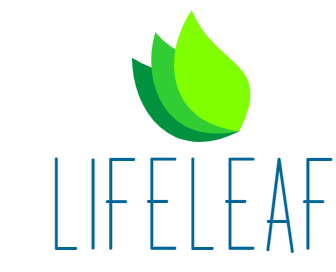
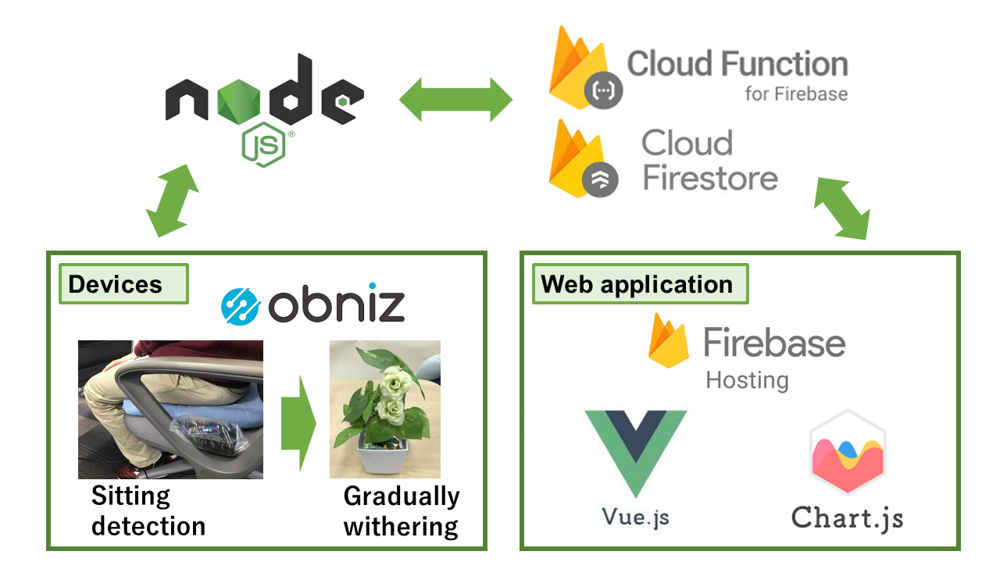
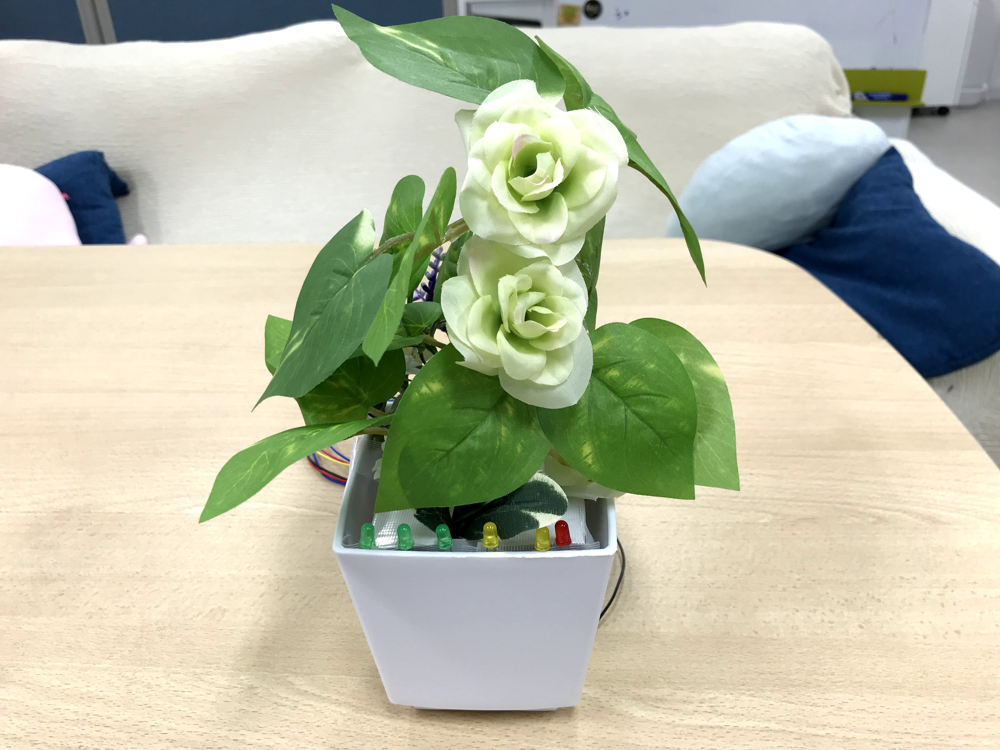
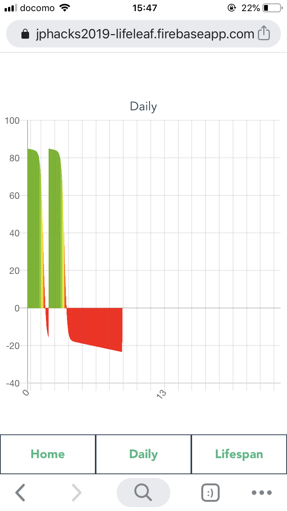
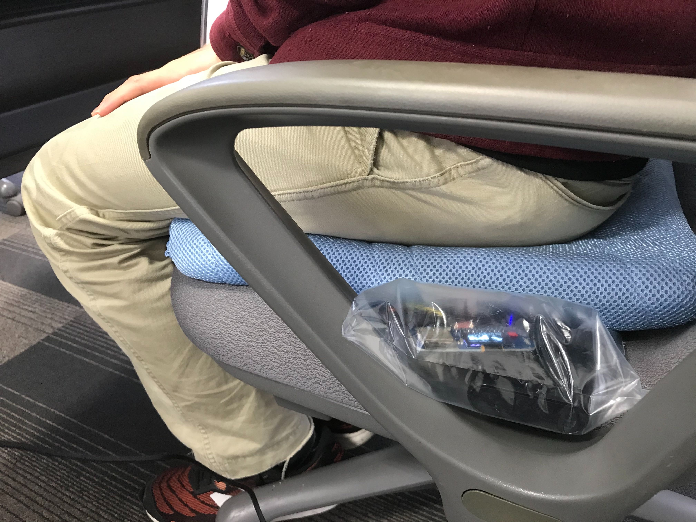

# Life Leaf

## 製品概要
### 長生き × Tech

### 背景（製品開発のきっかけ、課題等）
今回の開発にあたり着目したのがデスクワーク時の運動不足である．日常の大半を座って過ごす現代人にとって，座りすぎは，肥満，腰痛，集中力の低下や死亡率の増加に至るまで多大な健康被害を及ぼす．この問題の解決策として報告されているのは，1週間に1度のジム通いでも，毎日のランニングでもない．座って過ごす際に1時間に1度軽く運動（トイレや給湯室まで歩いたり，柔軟を行う等）を行うだけ，たったのそれだけで列挙した健康被害を大きく低減させることができる．
そこで私たちが提案するアプリケーションでは，座りすぎをユーザに伝えるものとなっている．伝えるといっても手段は多様で，既存のサービスや研究では振動や音，スマホ等への通知を利用したものが見受けられた．しかし，これらの手法ではユーザのタスクを阻害してしまう可能性が生じてきてしまう．この問題を解決するため，私たちのアプリケーションではふとしたタスクの合間に，長時間座り続けていたことがユーザに伝わるようなデザインにこだわり，デスク上の観葉植物を模したデバイスと着座を検知可能なクッション型デバイスを新たに実装した．

### 製品説明（具体的な製品の説明）
私たちが提案するアプリケーションでは，デスクワーク時の長時間の座りすぎをユーザに伝えるものとなっている．実装したものは，植物型デバイス，クッション型デバイスとそれらのデータをまとめて閲覧可能なWebアプリとなっている．ユーザが仕事を行う際，まず初めにクッション型デバイスがユーザが立っているか，座っているか感知する．ユーザが座っているときには，その時間を計測し30分を超えると植物型デバイスの葉がだんだんと垂れ下がっていく．植物型デバイスにはLEDも搭載しており着座時間に応じて緑→黄色→赤と変化する仕様となっている．この時，タスクを行っていたユーザが垂れ下がってきている葉やLEDに気づき，席から立ち上がるとクッション型デバイスが立ち上がったことを検知する．およそ１分ほど席を離れている状態が続くと徐々に植物型デバイスの葉が元気を取り戻してくる．ユーザは，元気になった植物型デバイスを確認し，再び集中してタスクに取り組むことができる．加えて，クッション型デバイスはWebアプリとも連動しており，取得した着座時間から日単位，週単位でどれだけデスクワークの合間に立ち上がることができたかをグラフで確認可能となっている．

座りすぎによる健康被害を植物の命に反映させ，視覚的にも明確にすることでユーザのタスクを邪魔することなく，デスクワーク時の運動を促すアプリケーションとなっている．

### 特長

#### 1. 特長1 植物型デバイス
クッション型デバイスの情報からユーザが着席しているか，離席しているかによって葉が動く仕様となっている．ユーザが長時間着席している際は葉がだんだんと下に下がり，元気がなくなっていく．
逆に，ユーザが仕事の合間席から立っているときは，植物はすこしづつ元気を取り戻していく．
ユーザの健康と植物の元気が連動するようなデバイスとなっている．

#### 2. 特長2 Webアプリ
Webアプリではクッション型デバイスから取得した情報をもとに1日の着席時間と離席時間をグラフ化してくれる．グラフは長時間の着席時の寿命の減りを参考に，座りすぎの危険信号がわかるようになっている．表示は日単位，週単位と存在し，自身がどれだけ運動することができたかを簡単に確認することができる．

#### 3. 特徴3 クッション型デバイス
クッション下で密閉された気圧センサの値をobnizを通して取得する．着座時の圧力を気圧変化で確認し，この情報をもとにWebアプリと植物型デバイスの連携を行う．

### 解決出来ること
現代人は日常で約8～9時間も座っている時間があるといわれており，座りすぎによる健康被害は社会的な問題にもなっている．今回提案するアプリでは，この社会問題を仕事や趣味の邪魔をすることなく低減させるものとなっている．

### 今後の展望
今回はWebアプリによる連動で，着座時と離席時のグラフのみを表示させていたが，例えば席を立った時の効果的なストレッチを提案することで離席時の運動をより有効的なものにしたり，昇降テーブルと組み合わせることで近未来的な健康重視のワークスペースを実現できると考えている．

## 開発内容・開発技術
### 活用した技術
#### API・データ
今回スポンサーから提供されたAPI、製品などの外部技術があれば記述をして下さい。
* obniz
* DSP310
* 

#### フレームワーク・ライブラリ・モジュール
* node.js
* vue.js
* chart.js
* firebase

#### デバイス
* obniz
* DSP310
* サーボモータ

### 研究内容・事前開発プロダクト（任意）
アイデア出しのみ

### 独自開発技術（Hack Dayで開発したもの）
#### 2日間に開発した独自の機能・技術
* obnizを用いた植物型デバイスおよびクッション型デバイス
* Vue.jsを用いたグラフ表示用のWebアプリケーション
